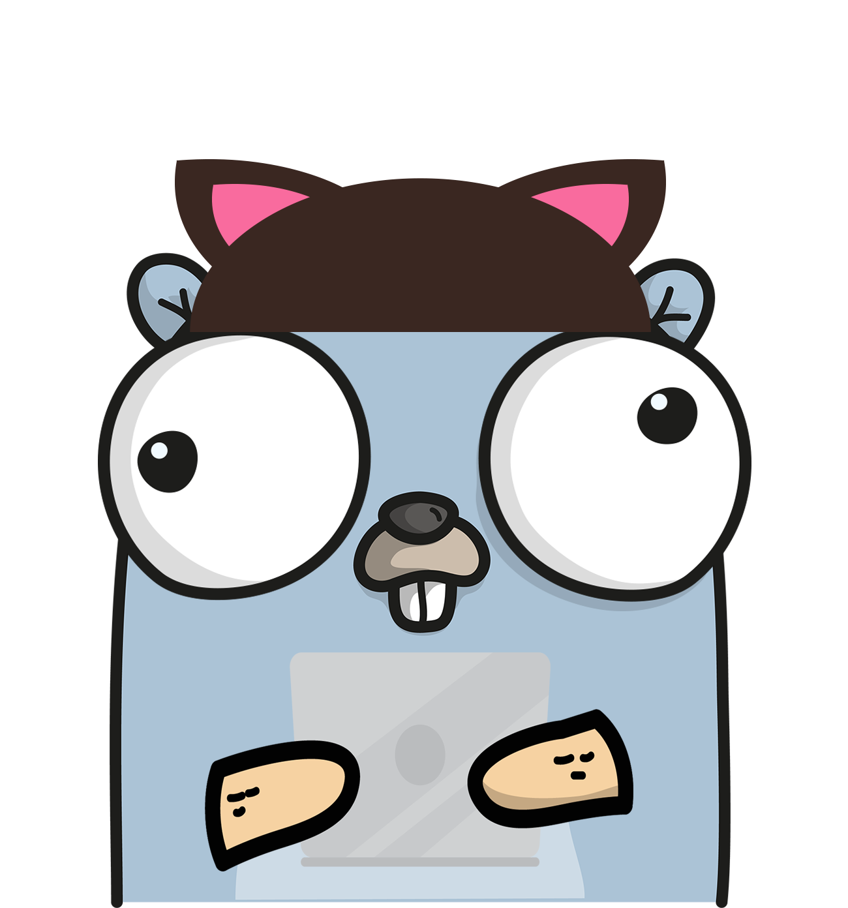

<p align="center">
  <a href="https://github.com/mccallry/cataas-go-sdk">
    
  </a>

  <h3 align="center">cataas-go-sdk</h3>

  <p align="center">
    Go SDK to Serve Cats to the Masses
    <br />
    <a href="https://github.com/mccallry/cataas-go-sdk/blob/main/README.GEN.md"><strong>Explore the docs »</strong></a>
    <br />
</p>

[![Go Report Card][badge-go-report-card]][url-go-report-card]
[![MIT License][badge-license]][url-license]
[![Go Reference][badge-go-reference]][url-go-reference]

## Getting Started
The Cataas SDK requires [Go][link-go] version [1.18](https://go.dev/doc/devel/release#go1.18) or above.

If you are managing multiple Go installations locally ([Go Docs](https://go.dev/doc/manage-install) | [gvm](https://github.com/moovweb/gvm)), ensure that you are using an appropriate version.

**Note:** [Go Modules](https://go.dev/wiki/Modules#how-to-use-modules) are used to manage dependencies.

### Installation
```sh
go get github.com/mccallry/cataas-go-sdk
```

## About The Project
The `cataas-go-sdk` is built on top of the [CATAAS][link-cataas] API, which provides the ability to receive a randomly selected cat picture. This SDK was generated using [OpenAPI Generator][link-openapi-generator].

### Built With

* [Cataas][link-cataas]
* [Go][link-go]
* [OpenAPI](https://www.openapis.org/)
* [OpenAPI Generator][link-openapi-generator]
* [GitHub Actions](https://github.com/features/actions)

## Usage

### Cats
The Cats API allows for Images or JSON metadata to be returned as a response. In order to have an image returned, the `"Accept"` header must be set to `"image/*"`, otherwise it will fallback to `"application/json"`.

In either case, the API returns three values:
1. A File of type [os.File](https://pkg.go.dev/os#File).
2. The HTTP response of type [http.Response](https://pkg.go.dev/net/http#Response).
3. An error.

When working with an image response, both the File and Response structs are able to be used to save or manipulate the file; however, in the case that a JSON response is expected, it is recommended to simply use the Response struct.

#### Image: os.File
<details>
<summary>Retrieve Image from os.File</summary>

```go
package main

import (
	"context"
	"io"
	"os"

	"github.com/h2non/filetype"
	cataas "github.com/mccallry/cataas-go-sdk"
)

func main() {
	config := cataas.NewConfiguration()
	config.AddDefaultHeader("Accept", "image/*")
	client := cataas.NewAPIClient(config)

	f, _, e := client.CatsAPI.CatRandom(context.Background()).Execute()
	if e != nil {
		panic(e.Error())
	}
	defer f.Close()

	// Read file to bytes, then return the cursor to the start of the file.
	fileBytes, e := io.ReadAll(f)
	if e != nil {
		panic(e.Error())
	}
	f.Seek(io.SeekStart, io.SeekStart)

	// Use filetype to determine if an image and retrieve file ext.
	if !filetype.IsImage(fileBytes) {
		panic("An unknown error occurred; file is not an image!")
	}

	fileType, e := filetype.Get(fileBytes)
	if e != nil {
		panic(e.Error())
	}

	// Create the output file and write.
	out, e := os.Create("./file." + fileType.Extension)
	if e != nil {
		panic(e.Error())
	}
	defer out.Close()

	io.Copy(out, f)
}
```

_For more examples, please refer to the [Documentation](./README.GEN.md)_
</details>

#### Image: HTTP Response
<details>
<summary>Retrieve Image from HTTP Response</summary>

```go
package main

import (
	"context"
	"io"
	"mime"
	"os"

	cataas "github.com/mccallry/cataas-go-sdk"
)

func main() {
	config := cataas.NewConfiguration()
	config.AddDefaultHeader("Accept", "image/*")
	client := cataas.NewAPIClient(config)

	_, resp, e := client.CatsAPI.CatRandom(context.Background()).Execute()
	if e != nil {
		panic(e.Error())
	}
	defer resp.Body.Close()

	// Get the returned Mime type.
	contentType := resp.Header.Get("Content-Type")
	if contentType == "" {
		panic("Mime type not provided by API!")
	}

	// Get the extensions for the returned type.
	exts, e := mime.ExtensionsByType(contentType)
	if e != nil {
		panic(e.Error())
	}

	// Create the output file and write.
	out, e := os.Create("./file" + exts[len(exts)-1])
	if e != nil {
		panic(e.Error())
	}
	defer out.Close()

	io.Copy(out, resp.Body)
}
```

_For more examples, please refer to the [Documentation](./README.GEN.md)_
</details>

#### JSON: HTTP Response
<details>
<summary>Retrieve JSON from HTTP Response</summary>

```go
package main

import (
	"context"
	"encoding/json"
	"fmt"

	cataas "github.com/mccallry/cataas-go-sdk"
)

type Response struct {
	ID        string   `json:"_id"`
	MimeType  string   `json:"mimetype"`
	Tags      []string `json:"tags"`
	CreatedAt string   `json:"createdAt"`
	UpdatedAt string   `json:"updatedAt"`
}

func main() {
	config := cataas.NewConfiguration()
	client := cataas.NewAPIClient(config)

	_, resp, e := client.CatsAPI.CatRandom(context.Background()).Execute()
	if e != nil {
		panic(e.Error())
	}
	defer resp.Body.Close()

	var r Response
	if e := json.NewDecoder(resp.Body).Decode(&r); e != nil {
		panic(e.Error())
	}

	fmt.Printf("%+v\n", r)
}
```

_For more examples, please refer to the [Documentation](./README.GEN.md)_
</details>

### API
The API API (which is a very fun name!) allows for the retrieval of bulk JSON metadata to be returned as a response. This includes retrieving a random list of cats, viewing the existing tags, or getting the count of cats images available via the API.

<details>
<summary>Retrieve API Metadata</summary>

```go
package main

import (
	"context"

	"github.com/davecgh/go-spew/spew"
	cataas "github.com/mccallry/cataas-go-sdk"
)

func main() {
	config := cataas.NewConfiguration()
	client := cataas.NewAPIClient(config)

	resp, _, e := client.APIAPI.ApiCats(context.Background()).Execute()
	if e != nil {
		panic(e.Error())
	}

	// Use go-spew to print while dereferencing pointers.
	spew.Dump(resp)
}
```

_For more examples, please refer to the [Documentation](./README.GEN.md)_
</details>

### Security and Admin
Both security and administration are restricted functions that are not available for public consumption and require authorization.

## License
Distributed under the MIT License. See [LICENSE][url-license] for more information.

## Acknowledgements
* [Cataas][link-cataas] | [Cataas GitHub](https://github.com/cataas/cataas)
* [Go pkgsite](https://pkg.go.dev/about)
* [Gopherize](https://gopherize.me/)
* [Shields](https://shields.io)
* [Open Source License](https://choosealicense.com)
* [README Template](https://github.com/othneildrew/Best-README-Template)

<!-- URLs -->
[url-go-report-card]: https://goreportcard.com/report/github.com/mccallry/cataas-go-sdk
[url-license]: https://github.com/mccallry/cataas-go-sdk/blob/main/LICENSE
[url-go-reference]: https://pkg.go.dev/github.com/mccallry/cataas-go-sdk

<!-- Badge Styles -->
[badge-go-report-card]: https://goreportcard.com/badge/github.com/mccallry/cataas-go-sdk
[badge-license]: https://img.shields.io/badge/License-MIT-green?label=License
[badge-go-reference]: https://pkg.go.dev/badge/github.com/mccallry/cataas-go-sdk.svg

<!-- External Links -->
[link-cataas]: https://cataas.com/
[link-openapi-generator]: https://openapi-generator.tech/
[link-go]: https://go.dev/